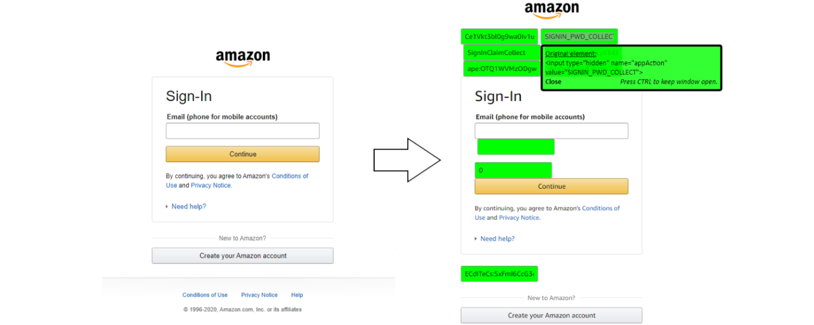

# Hidden HTML input Revealer

### Google Chrome Extension

Reveal hidden inputs on any web page. Eliminates the need to inspect element to discover, view, and alter hidden inputs and their values. Great for testing and debugging hidden inputs on web pages, whether it be as a developer, tester, security assessor, bug bounty hunter, or just out of curiosity.

